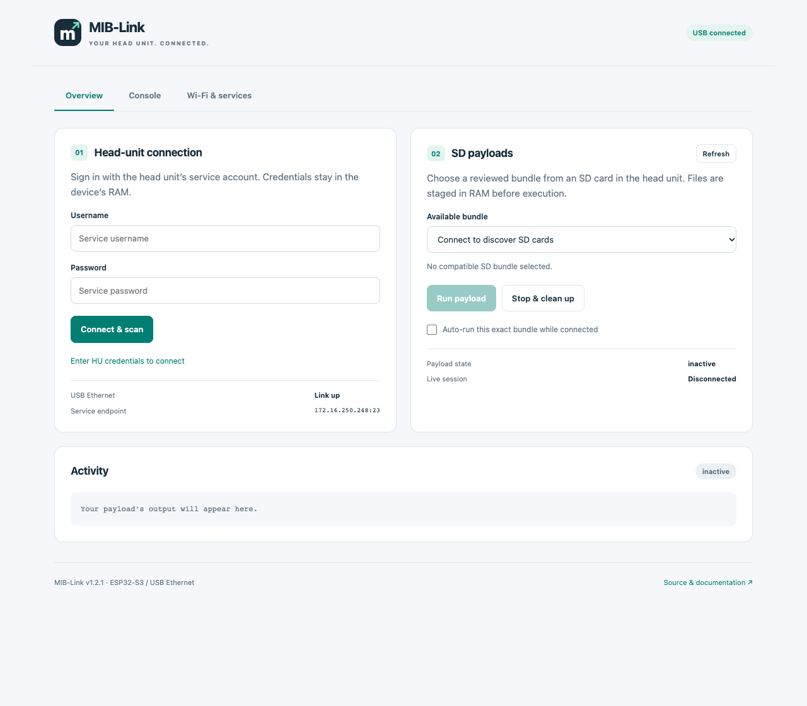

<div align="center">

# MST-Link

**A direct link to your head unit.**

Wi-Fi management, an interactive console, and native TCP service access — on **Raspberry Pi Pico W (RP2040)** or **ESP32-S3**.

[Download firmware](https://github.com/iscle/mst-link/releases/latest) · [Getting started](#getting-started) · [Build from source](docs/building.md) · [API & architecture](docs/architecture.md)


[](https://github.com/iscle/mst-link/actions/workflows/check.yml)

</div>



*The screenshot uses simulated connection status. It shows the actual offline UI embedded in the firmware.*

## What it does

- **Your own Wi-Fi network.** Change its name and password from the page. Settings survive power cycles and ordinary firmware updates.
- **A head-unit console in your browser.** Open the stock Telnet service, respond to login prompts, send commands, and interrupt with Ctrl+C. No application or Internet connection required.
- **Direct access with your own tools.** Three configurable TCP port mappings pass bytes unchanged to the head unit. Telnet, SSH, HTTP, and other TCP protocols use the same forwarding code.
- **SD payload management.** Discover manifest-based bundles, select one, stage verified files in head-unit RAM, run it, monitor its output and progress, and request cleanup. Auto-run is opt-in and trusts one exact bundle digest.
- **A small, self-contained firmware.** No cloud account, management key, external web fonts, CDN, or embedded head-unit password.

MST-Link provides access to services that the head unit already exposes. It does not enable disabled services, bypass their authentication, or include an Android Auto/cluster modification.

## Compatibility

| Component | Requirement |
| --- | --- |
| Supported boards | **Pico W / RP2040** with 2 MiB flash; **ESP32-S3** with at least 4 MiB flash and native USB exposed |
| ESP32-S3 memory | No PSRAM required; generic DIO/40 MHz flash configuration |
| USB connection | Data-capable cable to the head unit; ESP32-S3 must use **native USB (GPIO19 D− / GPIO20 D+)**, not a USB-UART bridge |
| Head unit | MHI2/QNX unit accepting the emulated ASIX USB Ethernet adapter |
| Service address | `172.16.250.248` on the head unit; adapter USB address `172.16.250.1` |
| SD management | Stock Telnet service on port 23, valid credentials, QNX ARM runtime, and the expected SD mount layout |
| Browser | Modern browser connected to MST-Link Wi-Fi |

The predecessor's stock USB service/login path was reported working on Porsche **MHI2_ER_POG11_P5250**. This standalone release adds new settings, UI, console, and forwarding code. Automated validation is documented [below](#validation); **the new firmware still needs a physical head-unit acceptance test**. The ESP32-S3 port is cross-compiled and automated-tested; physical ESP32-S3 USB/Wi-Fi acceptance is pending. Other head-unit trains, Pico 2 W, non-W RP2040 boards, and other ESP32 variants are not validated. See [ESP32-S3 setup](docs/esp32s3.md).

The USB descriptor uses the existing driver's `2001:3c05` compatibility identity. This is an independent project, with no endorsement from Porsche, Volkswagen, D-Link, ASIX, or Raspberry Pi.

## Getting started

1. Download the package for your board from [Releases](https://github.com/iscle/mst-link/releases/latest):
   - **Pico W:** `mst-link-pico-w.uf2`. Hold **BOOTSEL** while connecting it to your computer, then copy the UF2 to **RPI-RP2**.
   - **ESP32-S3:** `mst-link-esp32s3.zip`. Extract it, enter ROM download mode with **BOOT held during reset**, then run `python3 flash.py --port YOUR_SERIAL_PORT`. Install `esptool` 4.12 or 5.x first. Follow the [ESP32-S3 guide](docs/esp32s3.md) for wiring and flashing details.
2. Connect the adapter to a supported head-unit USB port using a data cable.
3. Join its Wi-Fi network and open **<http://192.168.4.1/>**. Accept your device's option to remain connected without Internet.
4. Set a personal Wi-Fi password under **Wi-Fi & services**. Saving restarts the device; reconnect using the new settings.

| Factory setting | Value |
| --- | --- |
| Wi-Fi name | `MST-Link` |
| Wi-Fi password | `mstlink1` |
| Management page | `http://192.168.4.1/` |
| Management key | None |

Wi-Fi names accept 1–32 printable ASCII characters. Passwords accept 8–63. Leave the password field empty to keep the existing password. The settings API never returns the saved password.

**Access is controlled by Wi-Fi membership.** Anyone on that network can use its management endpoints and TCP mappings. HTTP and Telnet are not encrypted above the Wi-Fi layer. Use your own Wi-Fi password and keep access limited to people you trust. Head-unit services still enforce their own login.

On Pico W, the LED toggles quickly while waiting for the USB network and slowly once the driver enables it. A slow blink indicates a network link, not a successful login. The generic ESP32-S3 build does not drive a board-specific LED; use the page for status.

## Connect directly to a service

Use the device's Wi-Fi address, with the local port listed on **Wi-Fi & services**:

| Default Local endpoint | Head-unit destination | Example |
| --- | --- | --- |
| `192.168.4.1:2323` | `172.16.250.248:23` | `telnet 192.168.4.1 2323` |
| `192.168.4.1:2222` | `172.16.250.248:22` | `ssh -p 2222 USER@192.168.4.1` |
| `192.168.4.1:8080` | `172.16.250.248:80` | `curl http://192.168.4.1:8080/` |

**These mappings do not imply SSH or HTTP is installed or enabled on your head unit.** Change any mapping to the TCP port you need. Use `0 → 0` to disable one. The page reserves TCP port 80 on the device. Three streams can be active simultaneously across all mappings.

Forwarding is independent of the application protocol. It does not rewrite embedded addresses or create extra data connections. Active FTP, discovery, multicast, UDP, and services that redirect clients to another IP may need a different approach. Native sessions expire after 30 minutes without forwarded data. This is a TCP gateway, not a general IP router or USB passthrough device.

## Use the browser console

Open **Console → Open console**, then enter the head unit's own login at its prompts. **Hide input** masks passwords in the input field. **Send** submits a line with CRLF; **Ctrl+C** sends an interrupt character.

This is a line-oriented, ASCII text console. Use a native Telnet client for full-screen applications, terminal escape handling, or non-ASCII output. The console keeps the most recent 8 KiB of output on the device; it reports when older output has expired. The page retains a bounded local view.

Browser and forwarded Telnet sessions are mutually exclusive. A manual Telnet session pauses SD management and disables its auto-run; reconnect through Overview afterward. A manual session is rejected while an SD management command is executing. Other forwarded services can operate concurrently.

Click **Disconnect** when finished. Closing the browser alone leaves the session until its 10-minute input-idle timeout. Commands already started on the head unit may continue after disconnection.

## Run a script from an SD card

MST-Link keeps the existing **`mhi2/manifest.json`** bundle format for compatibility. An SD card must contain:

```text
mhi2/
├── manifest.json
├── start.sh
├── stop.sh
└── ...other manifest-listed files
```

Start with the harmless [example bundle](sd-example/mhi2), which writes only to its RAM workspace. Generate a manifest after every edit:

```sh
python3 make_sd_bundle.py sd-example/mhi2 --name RAM-only-demo
```

Copy the `mhi2` directory to the SD root, insert the card into the head unit, then:

1. Enter the head-unit service username and password in **Overview → Connect & scan**.
2. Choose the bundle and click **Run payload**.
3. Watch **Activity** for output and any progress records the payload supplies.
4. Use **Stop & clean up** to call its stop script.

The runner verifies the selected manifest and file hashes before executing a RAM copy. Hash checking detects changed files; it does **not** establish that an unknown script is safe. Payloads run with the service account's privileges and can write persistent storage if their code does so. Review scripts before running them.

Head-unit credentials live only in device RAM. **Forget login** clears them; power loss also clears them. The firmware contains no default head-unit account or password.

Auto-run remembers one selected slot and digest only until the device restarts or the session fails. Unplugging the adapter does **not** stop an already running payload. Cleanup depends on the bundle's stop script; RAM staging itself disappears when the head unit reboots. See [the bundle contract](docs/bundles.md).

## Wi-Fi recovery and updates

Firmware updates preserve Wi-Fi settings when using the supplied UF2 or ESP32-S3 flash helper. Pico W alternates two CRC-checked flash records; ESP32-S3 uses a versioned NVS blob. Do not erase the ESP32-S3 NVS partition if you want to retain settings.

If you cannot connect, ground the recovery pin while powering on:

| Platform | Recovery input | Firmware flashing mode |
| --- | --- | --- |
| Pico W | **GP15 (physical pin 20)** to **GND (physical pin 18)** | Hold BOOTSEL while connecting USB |
| ESP32-S3 | **GPIO4** to GND (configurable at build time) | Hold BOOT/GPIO0 during reset, then release it |

The application uses `MST-Link` / `mstlink1` for that boot. Remove the recovery jumper, connect, and save new settings. Without saving, the previous settings return on the next normal boot. On ESP32-S3, BOOT/GPIO0 selects the ROM downloader and is **not** the settings recovery input. Only ground the documented recovery pin; do not connect it to a power pin.

## Build and contribute

See [building.md](docs/building.md) for pinned dependencies, the firmware build, host tests, UI tests, and rebuilding the QNX runner. The normal firmware build uses the included, source-built runner asset and does not require a QNX SDK. Its source hashes and compiler version are recorded in [assets/runner.json](assets/runner.json).

```sh
# Pico W
./scripts/bootstrap.sh
python3 build.py --target pico-w
./tests/run.sh
npm ci
npx playwright install chromium
npm test
python3 tests/check_uf2.py
```

For **ESP32-S3**, run `./scripts/bootstrap_esp32s3.sh`, source `external/esp-idf/export.sh`, then run `python3 build.py --target esp32s3`. See the [platform guide](docs/esp32s3.md).

Install the documented compiler and build prerequisites first. Build outputs are under `dist/`. Generated files, external SDKs, local credentials, and build directories are excluded from Git.

## Validation

Automated checks exercise:

- ASIX control requests and Ethernet framing under AddressSanitizer/UndefinedBehaviorSanitizer.
- Production lwIP code with packet-level HTTP fragmentation, TCP backpressure, stock login, SD run/stop, live progress, and auto-run checks.
- Browser console negotiation, bounded output, session checks, three simultaneous TCP services, half-close, refusal, and USB loss.
- Settings validation, Pico CRC records/interrupted writes, ESP32-S3 NVS error handling, delayed reboot, and recovery inputs.
- Native runner staging, hashes, firmware profiles, card removal, cleanup, malformed manifests, timeouts, and symlink rejection under sanitizers.
- Desktop/mobile browser flows and UF2 flash boundaries, binary round-trip, ESP32-S3 chip/partition/flash-bundle checks, and SHA-256.

These tests use simulated head-unit traffic and mocked browser API responses. They do not substitute for an acceptance test on the vehicle. The release checklist and remaining hardware checks are in [docs/validation.md](docs/validation.md).

## License

MST-Link source is **GPL-3.0-or-later**. Third-party components retain their original licenses; see [LICENSE](LICENSE), [NOTICE.md](NOTICE.md), and [licenses/](licenses/). No OEM firmware, proprietary QNX headers, vehicle dumps, or private login credentials are included.

## Contributing

Use the [code style and formatting guide](docs/formatting.md) before submitting changes. Run `npm run format:check` with the documented formatter environment active; CI checks formatting for both targets and the shared tools.
